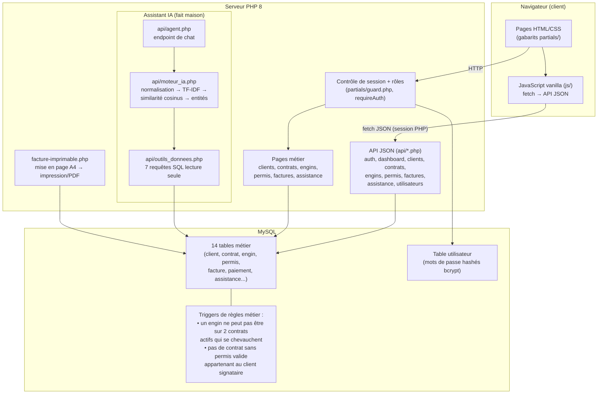
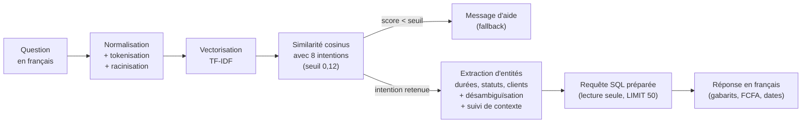
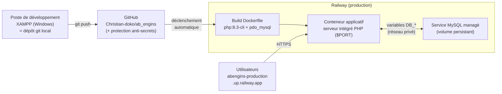

# Architecture du système AB ENGINS

> Les diagrammes ci-dessous sont rendus automatiquement par GitHub
> (ouvrir ce fichier sur github.com puis faire une capture d'écran pour le mémoire).

## 1. Architecture applicative (3 tiers)

## 2. Pipeline de l'assistant IA

## 3. Chaîne de déploiement continu

## Points à souligner dans le mémoire

- **Séparation en 3 tiers** : présentation (navigateur), traitement (PHP), données
  (MySQL) — chaque échange client↔serveur passe par le contrôle de session.
- **Règles de gestion en base** : les triggers garantissent l'intégrité même si
  une future interface contournait l'application. Deux règles sont implémentées
  au niveau du SGBD :
  1. un engin ne peut pas être affecté à deux contrats actifs sur des périodes
     qui se chevauchent ;
  2. **un contrat exige un permis d'exploitation** — `contrat.id_permis` est
     `NOT NULL`, et le permis présenté doit appartenir au client signataire,
     couvrir la date de signature et ne pas être suspendu
     (voir `sql/migration_permis_obligatoire.sql`).
- **Assistant IA autonome** : aucun service externe — tout le pipeline s'exécute
  dans le tiers traitement, les données ne quittent jamais le système.
- **Déploiement continu** : un `git push` suffit pour mettre la production à jour ;
  les secrets (identifiants base) sont des variables d'environnement, jamais dans
  le code — la protection anti-secrets de GitHub le vérifie à chaque push.
